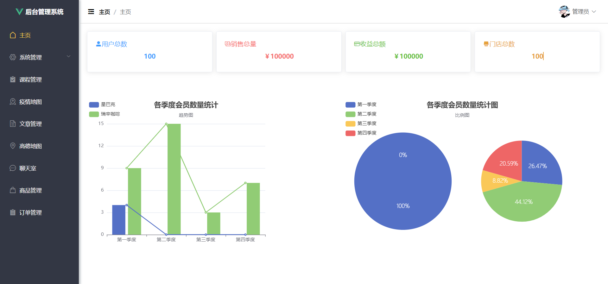
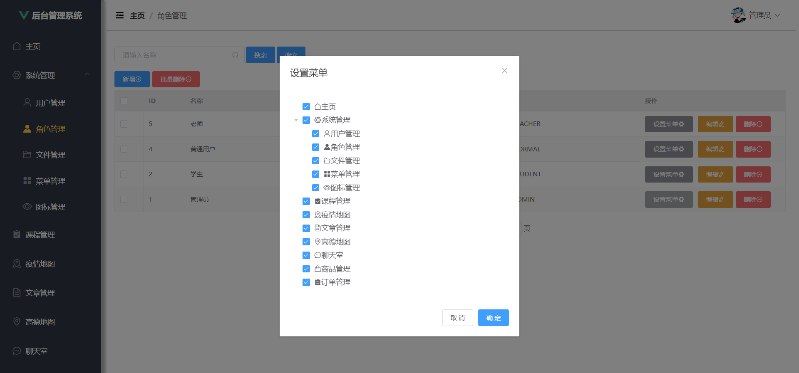
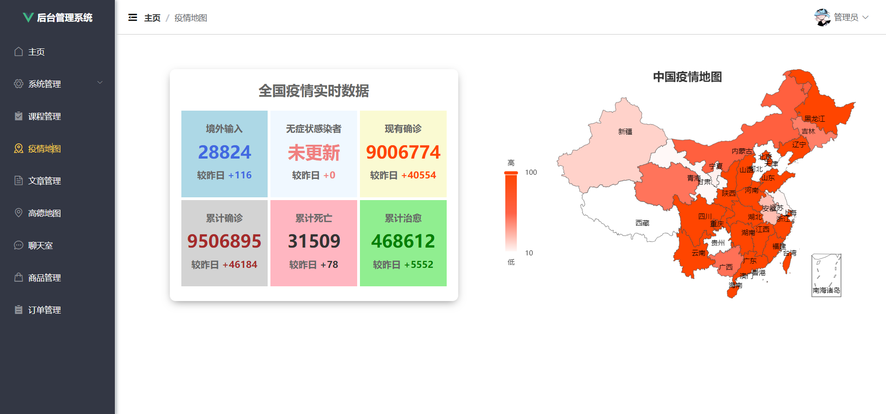

#### 介绍

基于SpringBoot+Vue前后端分离的通用后台管理系统，支持动态分配权限，实时的疫情地图，高德地图，沙箱支付等

在线网址：http://121.40.41.122/ManagementSystem

#### 软件架构

B/S架构，采用前后端分离技术

#### 安装教程

1、Java项目一键启动

2、前端项目先下载依赖npm install

3、前台页面启动npm run serve

4、将sql文件夹下的sql文件导入MySQL中

#### 技术介绍

前端技术：Vue2 + Vuex + Vue - Router + Axios + Element - ui + Echarts + JavaScript

后端技术：SpringBoot + Jwt + MyBatisPlus + MySQL+ Redis + Swagger + Druid + WebSocket

* 实现RBAC权限模型，可进行动态分配权限

* Swagger生产接口文档，方便前端接入数据

* JWT进行身份权限认证

* Redis缓存数据，加快查询效率

* 集成支付宝沙箱支付

* 在线聊天室功能

#### 页面效果

* 首页

* 分配权限

* 疫情地图

#### 可加QQ询问

QQ：2740860037
